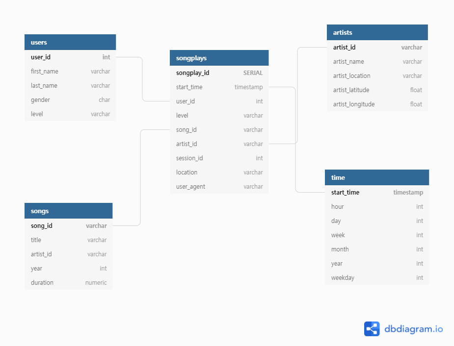

# Data Modeling with Postgres

## Introduction

A startup called Sparkify wants to analyze the data they've been collecting on songs and user activity on their new music streaming app. The analytics team is particularly interested in understanding what songs users are listening to. Currently, they don't have an easy way to query their data, which resides in a directory of JSON logs on user activity on the app, as well as a directory with JSON metadata on the songs in their app.

They'd like a data engineer to create a Postgres database with tables designed to optimize queries on song play analysis, and bring you on the project. Your role is to create a database schema and ETL pipeline for this analysis. You'll be able to test your database and ETL pipeline by running queries given to you by the analytics team from Sparkify and compare your results with their expected results.

## Project Description

In this project, you'll apply what you've learned on data modeling with Postgres and build an ETL pipeline using Python. To complete the project, you will need to define fact and dimension tables for a star schema for a particular analytic focus, and write an ETL pipeline that transfers data from files in two local directories into these tables in Postgres using Python and SQL.


## How to run?

At the terminal:

1. ```python create_tables.py```
2. ```python etl.py```


## Database Schema

After examining the Log and Song JSON files, I created a Star schema (shown below) that include one Fact table (songplays) and 4 Dimension tables.




### Song Dataset

The first dataset is a subset of real data from the Million Song Dataset. Each file is in JSON format and contains metadata about a song and the artist of that song. The files are partitioned by the first three letters of each song's track ID. For example, here are filepaths to two files in this dataset.

```
song_data/A/B/C/TRABCEI128F424C983.json
song_data/A/A/B/TRAABJL12903CDCF1A.json
```

And below is an example of what a single song file, TRAABJL12903CDCF1A.json, looks like.

```
{
    "num_songs": 1,
    "artist_id": "ARJIE2Y1187B994AB7",
    "artist_latitude": null,
    "artist_longitude": null,
    "artist_location": "",
    "artist_name": "Line Renaud",
    "song_id": "SOUPIRU12A6D4FA1E1",
    "title": "Der Kleine Dompfaff",
    "duration": 152.92036,
    "year": 0
}
```

This information is parsed to populate the Songs and Artists Dimension tables.

### Log Dataset

The log files in the dataset are partitioned by year and month. For example, here are filepaths to two files in this dataset.

```
log_data/2018/11/2018-11-12-events.json
log_data/2018/11/2018-11-13-events.json
```

This data contains information of which songs Users listened to at a specific time. Information is parsed to provide data for the Songplays Fact table and the Users and Time Dimension tables. The ```songplays.artist_id``` and ```songplays.song_id``` columns are populated by a lookup based on the Song Title, Artist Name and song Duration.

## Project Structure

```
Data Modeling with Postgres
|____data			# Dataset
| |____log_data
| | |____...
| |____song_data
| | |____...
|
|____etl.ipynb		    # developing ETL builder
|____test.ipynb		    # testing ETL builder
|____etl.py			    # ETL builder
|____sql_queries.py		# ETL query helper functions
|____create_tables.py   # database/table creation script
```


## ETL Pipeline
### etl.py
ETL pipeline builder

1. `process_data`
	* Iterating dataset to apply `process_song_file` and `process_log_file` functions
2. `process_song_file`
	* Process song dataset to insert record into _songs_ and _artists_ dimension table
3. `process_log_file`
	* Process log file to insert record into _time_ and _users_ dimensio table and _songplays_ fact table

### create_tables.py
Creating Fact and Dimension table schema

1. `create_database`
2. `drop_tables`
3. `create_tables`

### sql_queries.py
Helper SQL query statements for `etl.py` and `create_tables.py`

1. `Drop_tables_queries`
2. `Create_tables_queries`
3. `insert_queries`
4. `select_song_query`

### etl.ipynb

A Python Jupyter Notebook that was used to initially explore the data and test the ETL process.

### test.ipynb

A Python Jupyter Notebook that was used to test that data was loaded properly.