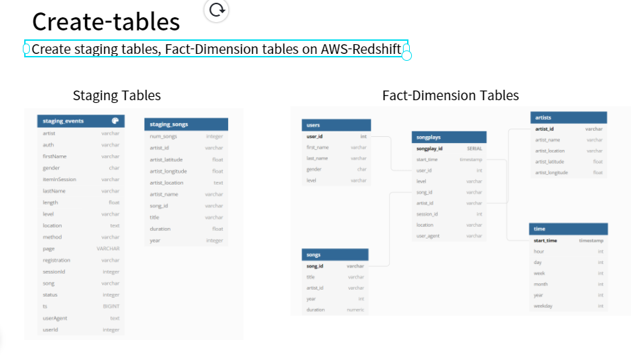
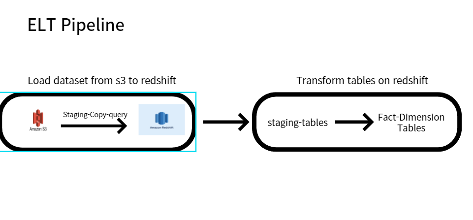

# Project: Data Warehouse
## Introduction
A music streaming startup, Sparkify, has grown their user base and song database and want to move their processes and data onto the cloud. Their data resides in S3, in a directory of JSON logs on user activity on the app, as well as a directory with JSON metadata on the songs in their app.

As their data engineer, you are tasked with building an ETL pipeline that extracts their data from S3, stages them in Redshift, and transforms data into a set of dimensional tables for their analytics team to continue finding insights into what songs their users are listening to. You'll be able to test your database and ETL pipeline by running queries given to you by the analytics team from Sparkify and compare your results with their expected results.

## Project Description
In this project, you'll apply what you've learned on data warehouses and AWS to build an ETL pipeline for a database hosted on Redshift. To complete the project, you will need to load data from S3 to staging tables on Redshift and execute SQL statements that create the analytics tables from these staging tables.


## Project Datasets
You'll be working with two datasets that reside in S3. Here are the S3 links for each:

Song data: s3://udacity-dend/song_data
Log data: s3://udacity-dend/log_data
Log data json path: s3://udacity-dend/log_json_path.json


## Project Structures 

### How to run?

1. Create AWS-Redshift cluster using boto3 client
2. Setting AWS configuration on `dwh.cfg`
3. Run create_tables.py 
    using ```python create_tables.py```
4. Run etl.py 
    using  ```python etl.py```
5. Check the results on jupyter notebook `ETL-test.ipynb`

### create_tables.py
Creating Staging Table and Fact-Dimension table schema 

1. `drop_tables`
2. `create_tables`



### etl.py 
Build ELT pipeline to from AWS S3 to Redshift cluster

1. `load_staging_tables`
2. `insert-tables`



### sql_queries.py
SQL query statement collection  

1. `drop_table_queries`
2. `create_table_queries`
3. `staging_copy_table_queries`
4. `insert_table_queries`