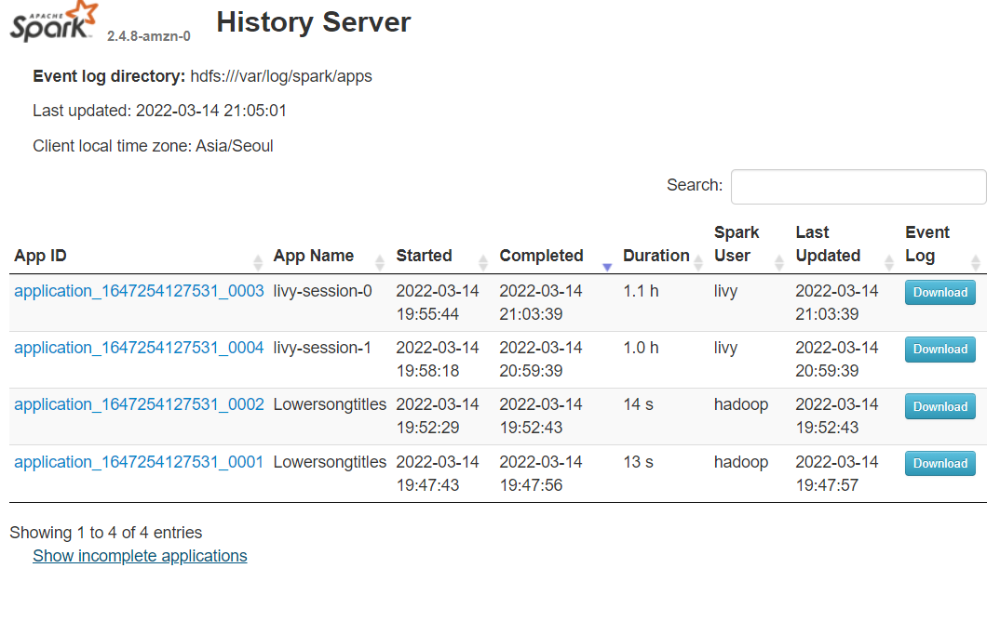
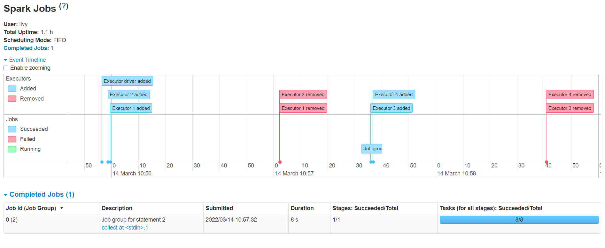
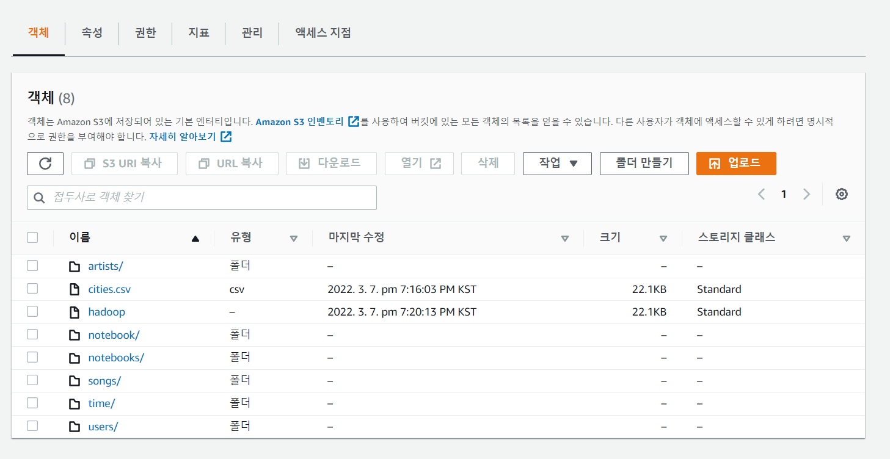
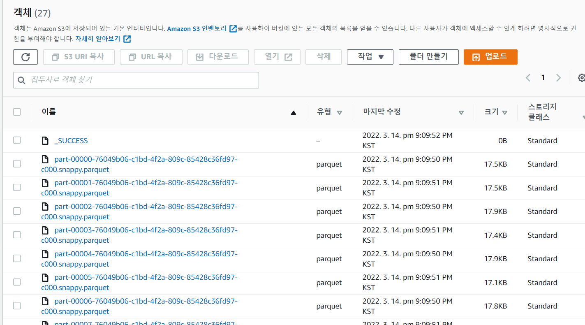
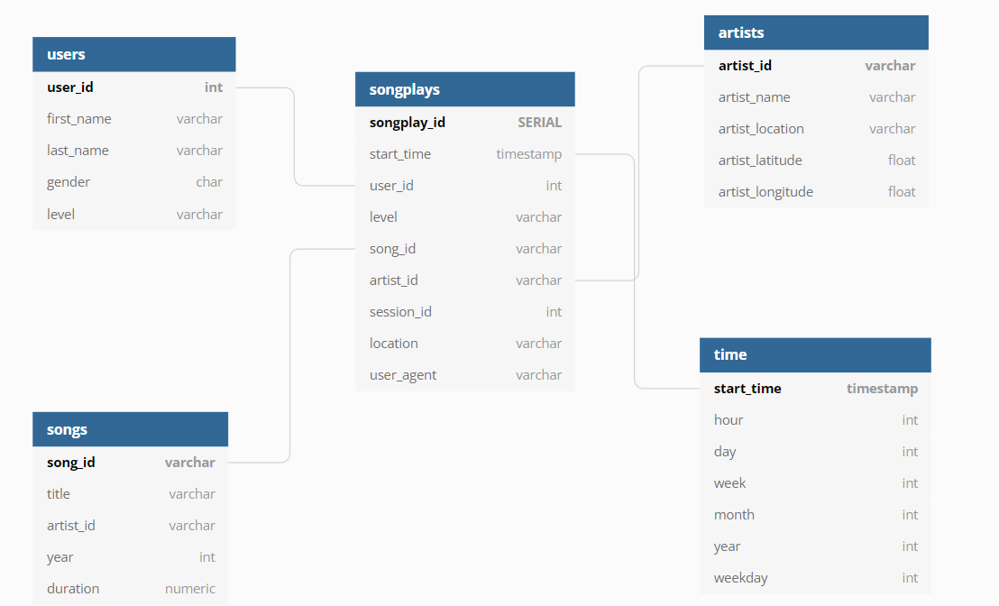

# Project: Spark and Data Lake 
This project builds an **ETL pipeline** for **Data Lake**.
ETL pipeline will extract song and log data from Source S3 bucket 
to Target S3 bucket that will be **Data Lake**. This **ETL pipeline** 
loads a set of dimension tables in spark parquet files into Target S3 bucket(Data lake).

## Project Structure 

### etl.py 
This python file process extract song and log data json file in the Source 
S3 bucket, transforms the data into fact-dimension tables and loads fact-dimension tables into Target S3 bucket as parquet files.

### dl.cfg
This file contains AWS access_key and secret_key 
    and S3 bucket endpoints.

## How to Run 
1. Set AWS Access_key and secret_access_key and 
    S3 target bucket endpoint in `dl.cfg`

2. Create AWS EMR Cluster notebook

3. Connect to EC2 Server of AWS EMR master node
    using a Bash shell.

4. Upload `dl.cfg` and `etl.py` on hadoop directory
    of Aws EMR master node.

5. Run `etl.py` using command:
    'spark-submit etl.py'

### Results

1. After few hour, we can check our spark job 
    in the Spark History  Server page.

2. Finally, we can check our S3 bucket.

### Database Schema 

