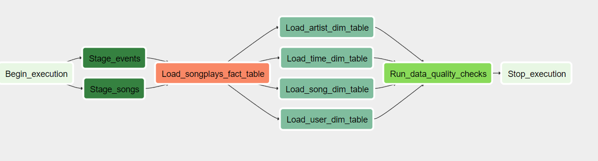
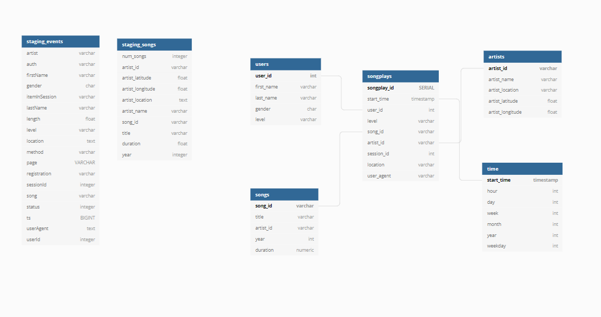

# Project: Data Pipeline with Apache Airflow 
This projects let us work on building automate data pipeline using 
Apache Airflow. To Extract raw dataset from **AWS S3** to **AWS Redshift**, we configure and schedule data pipeline on **Apache Airflow Web UI** and transform load data from staging tables to dimension tables.
Then, we monitor production data pipelines by running data quality check operator DAG to track data lineage.

## Project Structure 

## plugins 
### Helpers
1. `sql_queries.py`
- This file contains SQL queries to insert from staging tables into fact-dimension tables 

### Operators 
1. `stage_redshift.py`
    - Copy raw dataset from S3 to Redshift

2. `load_fact.py`
    - Execute INSERT query into fact table on Redshift

3. `load_dimension.py`
    - Execute INSERT query into dimension tables on Redshift

4. `data_quality.py`
    - Execute Data Quality check after pipeline execution

## How to Run 
1. Create IAM user and Redshift cluster on AWS account 
2. Turn on Airflow on your workspace 
3. Create AWS and Redshift connection on Airflow Web UI 
4. Run `create_table_dag.py` DAG to create staging tables 
    and Fact-Dimension tables on Redshift cluster 
5. Run `udac_example_dag.py` DAG to process ETL data pipeline 

## Airflow Data Pipeline 
### Airflow DAG overview

### Task Operators 
1. Dummy Operators 
    - `Begin_exeuction` 
    - `End_execution` 
    
    Dummy Operators at Data pipeline end points 

2. Staging_to_Redshift Operators 
    - `stage_events_to_redshift`
    - `stage_songs_to_redshift`

    Extract/Transform data from S3 to Redshift to create staging tables

3. Load Fact-Dimension Table Operators 
    - `load_songplays_table`
    - `load_user_dimension_table`
    - `load_song_dimension_table`
    - `load_artist_dimension_table`
    - `load_time_dimension_table`

    Load data from staging tables to Fact-Dimension tables 

4. Data Quality Check Operator 
    - `run_quality_checks`
    
    Checking if there is no data and number of records on each tables.

## Database Schema

